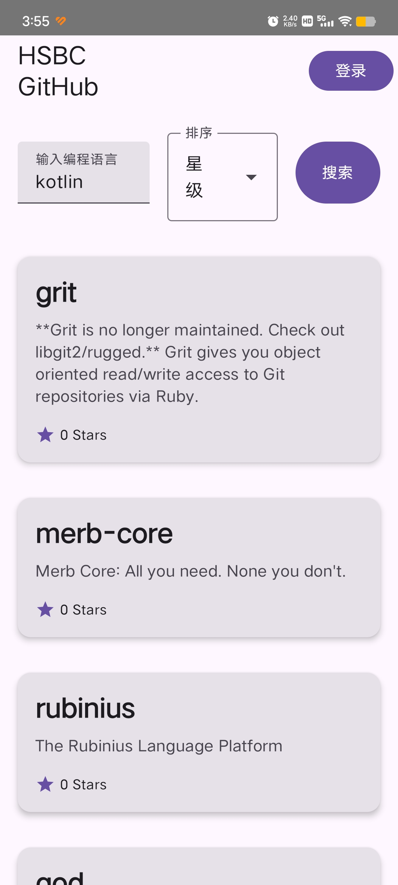
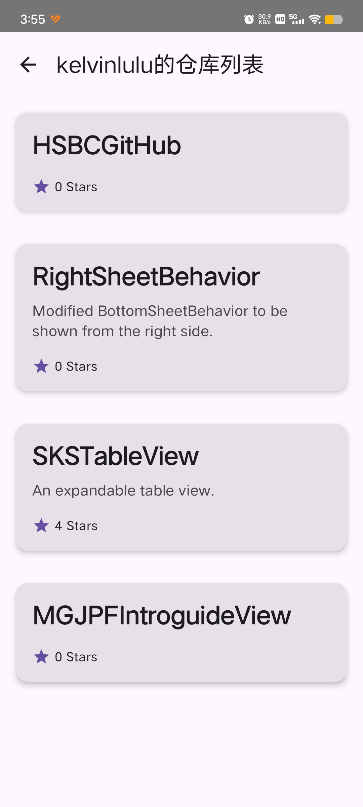
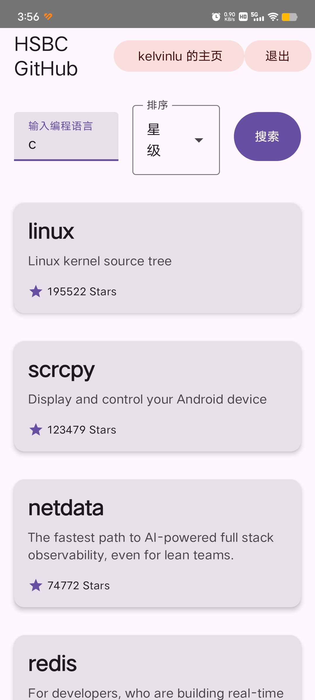
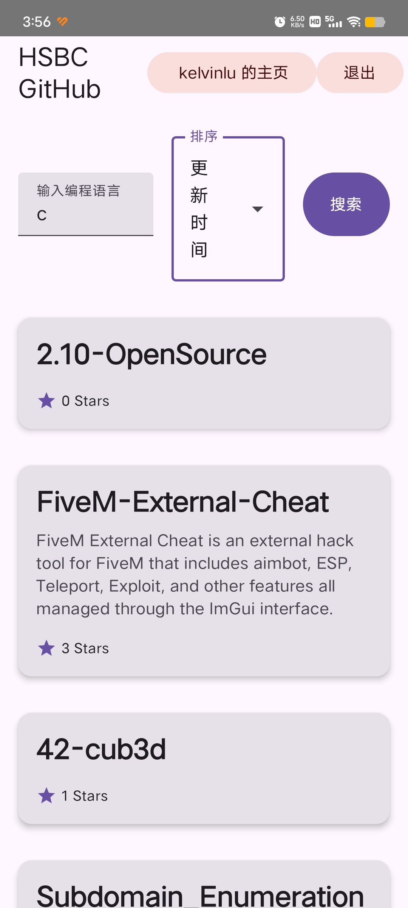
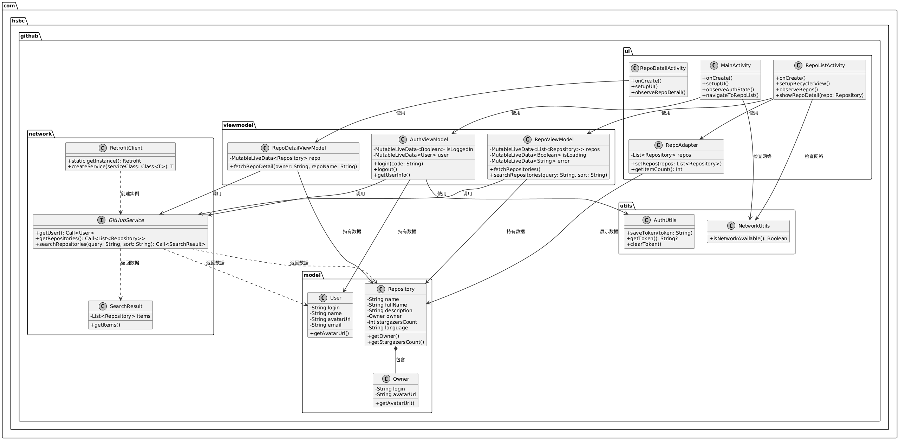

### 核心功能

1. **用户认证**：通过 GitHub OAuth 流程实现账号登录，支持回调授权码自动获取访问令牌。
2. **仓库浏览**：展示用户个人仓库列表，支持按编程语言搜索和按星级/更新时间排序。
3. **仓库详情**：点击仓库项可查看详情，包括名称、描述、星标数等信息。
4. **仓库列表展示**：展示 `https://api.github.com/repositories` 返回的仓库列表。
5. **交互设计**：顶部栏动态显示登录状态（用户名/登录按钮），支持退出登录操作。

### 界面展示
1. **热门仓库列表** 展示  
   

2. **登录后个人仓库列表** 展示  
   

3. **仓库详情** 展示  
   

4. **根据语言搜索仓库** 展示（以搜索C为例，星级最高的仓库是linux）  
   

5. **按更新时间搜索C语言仓库** 展示（星级最高的仓库是linux）  
   

### 尚未完成的功能

1. 提 issue 功能尚未实现。
2. 开发未遵循 TDD（测试驱动开发）模式。
3. 未添加混淆，apk体积偏大。

### 技术方案

1. **UI**：Jetpack Compose（Material 3 设计）
2. **逻辑**：MVVM 架构（ViewModel + LiveData）
3. **网络**：Retrofit + Coroutine
4. **数据**：Kotlin 数据类建模

### UMl类图  

